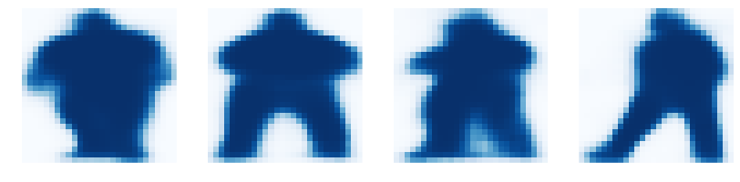

## Mask R-CNN for Object Detection and Segmentation
This is an implementation of Mask R-CNN on Python 3, Keras, and TensorFlow. The model generates bounding boxes and segmentation masks for each instance of an object in the image. It's based on Feature Pyramid Network (FPN) and a ResNet101 backbone.


The repository includes:
* Source code of Mask R-CNN built on FPN and ResNet101.
* Training code for MS COCO
* Pre-trained weights for MS COCO
* Jupyter notebooks to visualize the detection pipeline at every step
* ParallelModel class for multi-GPU training
* Evaluation on MS COCO metrics (AP)

### Getting Started
* [demo.ipynb](samples/demo.ipynb) Is the easiest way to start. It shows an example of using a model pre-trained on MS COCO to segment objects in your own images.
It includes code to run object detection and instance segmentation on arbitrary images.

* [train_shapes.ipynb](samples/shapes/train_shapes.ipynb) shows how to train Mask R-CNN on your own dataset. This notebook introduces a toy dataset (Shapes) to demonstrate training on a new dataset.

* ([model.py](mrcnn/model.py), [utils.py](mrcnn/utils.py), [config.py](mrcnn/config.py)): These files contain the main Mask RCNN implementation. 

* [inspect_data.ipynb](samples/coco/inspect_data.ipynb). This notebook visualizes the different pre-processing steps
to prepare the training data.

* [inspect_model.ipynb](samples/coco/inspect_model.ipynb) This notebook goes in depth into the steps performed to detect and segment objects. It provides visualizations of every step of the pipeline.

* [inspect_weights.ipynb](samples/coco/inspect_weights.ipynb)
This notebooks inspects the weights of a trained model and looks for anomalies and odd patterns.

### Step by Step Detection
To help with debugging and understanding the model, there are 3 notebooks 
([inspect_data.ipynb](samples/coco/inspect_data.ipynb), [inspect_model.ipynb](samples/coco/inspect_model.ipynb),
[inspect_weights.ipynb](samples/coco/inspect_weights.ipynb)) that provide a lot of visualizations and allow running the model step by step to inspect the output at each point. Here are a few examples:

### 1. Anchor sorting and filtering
Visualizes every step of the first stage Region Proposal Network and displays positive and negative anchors along with anchor box refinement.


### 2. Bounding Box Refinement
This is an example of final detection boxes (dotted lines) and the refinement applied to them (solid lines) in the second stage.


### 3. Mask Generation
Examples of generated masks. These then get scaled and placed on the image in the right location.



### 4.Layer activations
Often it's useful to inspect the activations at different layers to look for signs of trouble (all zeros or random noise).


### 5. Weight Histograms
Another useful debugging tool is to inspect the weight histograms. These are included in the inspect_weights.ipynb notebook.


### 6. Logging to TensorBoard
TensorBoard is another great debugging and visualization tool. The model is configured to log losses and save weights at the end of every epoch.


### 6. Composing the different pieces into a final result


### Requirements
Python 3.4, TensorFlow 1.3, Keras 2.0.8 and other common packages listed in `requirements.txt`.

### MS COCO Requirements:
To train or test on MS COCO, you'll also need:
* pycocotools (installation instructions below)
* [MS COCO Dataset](http://cocodataset.org/#home)
* Download the 5K [minival](https://dl.dropboxusercontent.com/s/o43o90bna78omob/instances_minival2014.json.zip?dl=0)
  and the 35K [validation-minus-minival](https://dl.dropboxusercontent.com/s/s3tw5zcg7395368/instances_valminusminival2014.json.zip?dl=0)
  subsets. More details in the original [Faster R-CNN implementation](https://github.com/rbgirshick/py-faster-rcnn/blob/master/data/README.md).

### Installation
1. Clone this repository
2. Install dependencies
   ```bash
   pip3 install -r requirements.txt
   ```
3. Run setup from the repository root directory
    ```bash
    python3 setup.py install
    ``` 
3. Download pre-trained COCO weights (mask_rcnn_coco.h5) from the [releases page](https://github.com/matterport/Mask_RCNN/releases).
